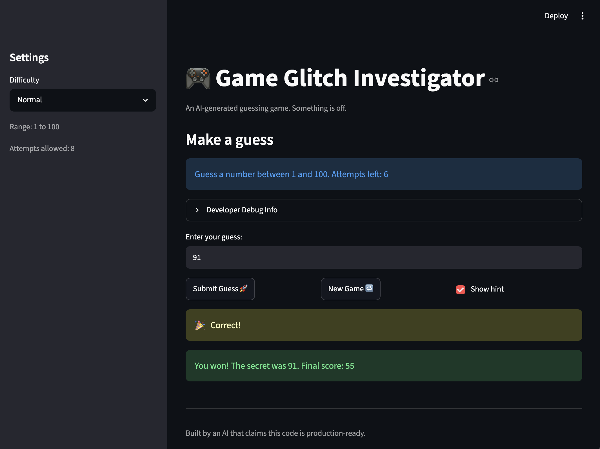

# 🎮 Game Glitch Investigator: The Impossible Guesser

## 🚨 The Situation

You asked an AI to build a simple "Number Guessing Game" using Streamlit.
It wrote the code, ran away, and now the game is unplayable. 

- You can't win.
- The hints lie to you.
- The secret number seems to have commitment issues.

## 🛠️ Setup

1. Install dependencies: `pip install -r requirements.txt`
2. Run the broken app: `python -m streamlit run app.py`

## 🕵️‍♂️ Your Mission

1. **Play the game.** Open the "Developer Debug Info" tab in the app to see the secret number. Try to win.
2. **Find the State Bug.** Why does the secret number change every time you click "Submit"? Ask ChatGPT: *"How do I keep a variable from resetting in Streamlit when I click a button?"*
3. **Fix the Logic.** The hints ("Higher/Lower") are wrong. Fix them.
4. **Refactor & Test.** - Move the logic into `logic_utils.py`.
   - Run `pytest` in your terminal.
   - Keep fixing until all tests pass!

## 📝 Document Your Experience

- The game is a Streamlit number guessing game where the player tries to guess a secret number within a limited number of attempts. 
- I found that the hint messages were reversed, so guesses above the secret number said "GO HIGHER" and guesses below the secret number said "GO LOWER."
- I also found that the New Game button did not restart the game because some Streamlit session state values were not reset.
- I fixed the hint logic, reset the session state values for a new game, moved check_guess() into logic_utils.py and updated pytest tests.

## 📸 Demo Walkthrough

1. User starts the app and selects a difficulty level
2. User opens Developer Debug Info to view the secret number for testing
3. User enters a guess below the secret number and the game returns "GO HIGHER"
4. User enters a guess above the secret number and the game returns "GO LOWER"
5. User enters the correct secret number and the game shows a win message with the final score
6. User clicks "New Game" and the app resets the secret number, score, attempts, status and guess history.

## Screenshot




## 🧪 Test Results

```text
$ pytest
=================== test session starts ===================
platform darwin -- Python 3.14.5, pytest-9.1.1, pluggy-1.6.0
collected 3 items

tests/test_game_logic.py ...                        [100%]

==================== 3 passed in 0.02s ====================
```

## 🚀 Stretch Features

- [ ] [If you choose to complete Challenge 4, describe the Enhanced UI changes here — a screenshot is optional]
